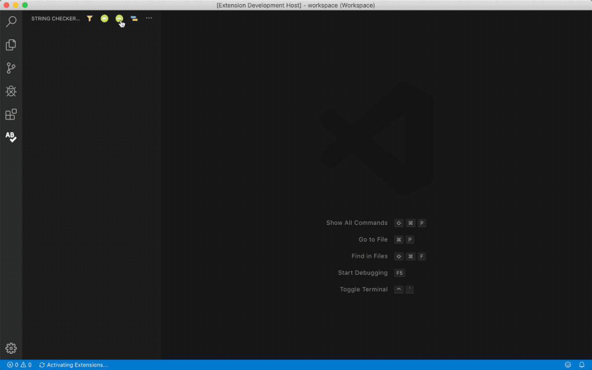
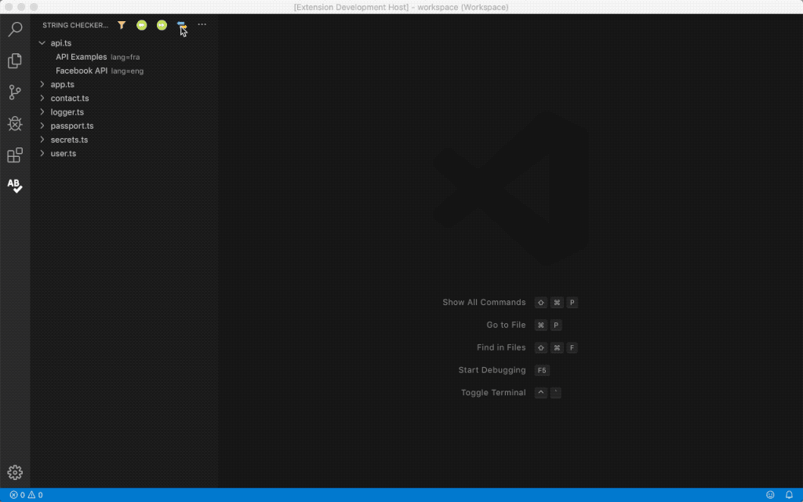
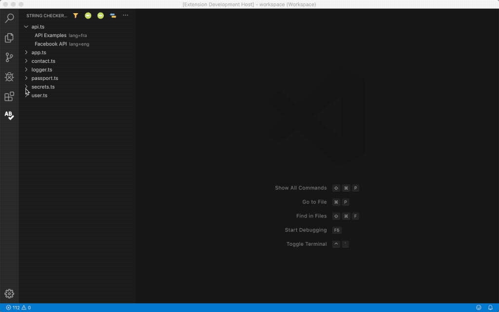
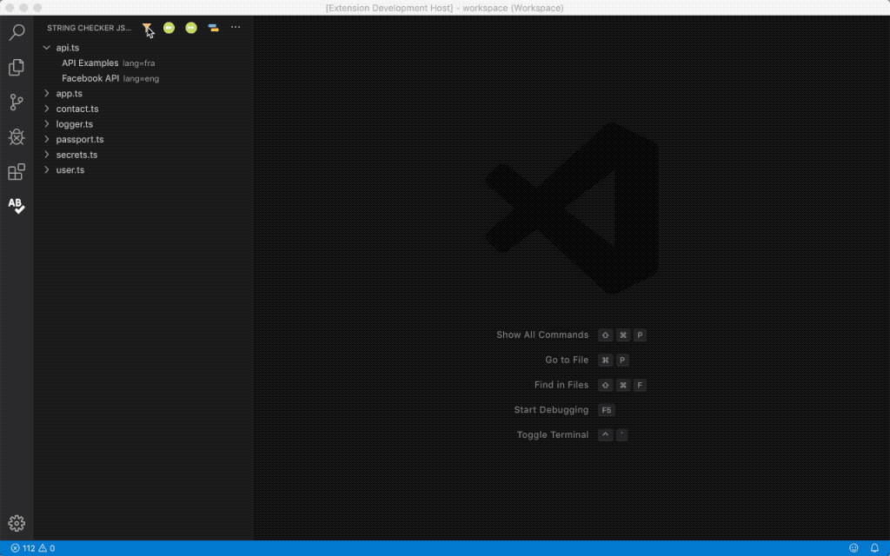
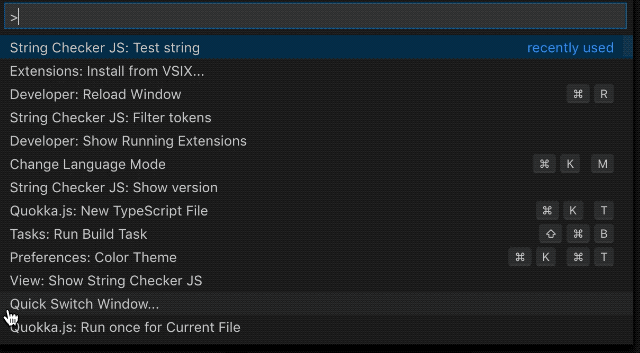

# String Checker JS

Scan TypeScript and JavaScript documents for non-technical strings.

The aim is to help identifying strings in code that might need to be translated.  
Such strings should be moved in a dedicated resource file for translation purpose.

## Features

**Scan** workspace documents, and **navigate** from string to string in source code:

**Switch** view to browse detected strings:

Add **custom rules** to improve string detection:

**Search** for strings in view:

### Detection providers

Strings are evaluated by different providers, each being dedicated to a specific area.

| Provider | Description | Example |
|---|---|---|
| Keywords provider | Detects strings from **user list**. | "far fa-smile" will be detected as a [Font Awesome smile icon](https://fontawesome.com/icons/smile?style=regular). |
| Class provider | Detects strings as **class names**. |  |
| Code provider | Detects strings as **code** (variable names). | "../path/to/my/file" will be detected as a path. "someVariable" will be detected as a camel case variable. |
| Natural language provider | Detects strings as **natural language**. | ["Ceci n'est pas une pipe"](https://en.wikipedia.org/wiki/Ren%C3%A9_Magritte) will be detected as french language. |
| Entropy provider | Detects string as **[Gibberish](https://en.wikipedia.org/wiki/Gibberish)**. String [entropy](https://en.wikipedia.org/wiki/Entropy_(information_theory)) threshold can be configured in settings (`entropy.threshold`, default = 3). | "abbcccddddeeeee" has an entropy of 2.15. "dd/MM/yyyy hh:mm:ss" has an entropy of 2.88. ["Gloubi-boulga"](https://fr.wikipedia.org/wiki/Gloubi-boulga) has an entropy of 2.93. |
| String provider | **Pass-through** detection. | *Any string will be detected as such.* |

The `string.checker.js.testString` [command](#extension-settings) brings a convenient way to test all providers for a given string.

<!-- TODO: Image URLs in README.md and CHANGELOG.md need to resolve to https URLs. -->

## Requirements

*There are no known requirements.*

## Extension Settings

This extension contributes the following settings:

- `string.checker.js.scanDocument`: scan selected document.
- `string.checker.js.scanDocumentIncludeAll`: scan selected document for any string.
- `string.checker.js.scanDocumentWorkspace`: scan workspace documents.
- `string.checker.js.scanDocumentWorkspaceIncludeAll`: scan workspace documents for any string.
- `string.checker.js.switchView`: switch between file/token and token/file view.
- `string.checker.js.excludeParentFolderPath`: exclude a file (using its path) containing folder from scan [1].
- `string.checker.js.excludeParentFolderName`: exclude a file (using its name) containing folder from scan [1].
- `string.checker.js.excludeFilePath`: exclude a file (using its path) from scan [1].
- `string.checker.js.excludeFileName`: exclude a file (using its name) from scan [1].
- `string.checker.js.excludeToken`: exclude a token from scan result.
- `string.checker.js.includeToken`: include a token to scan result.
- `string.checker.js.selectTreeItem`: select token in document.
- `string.checker.js.filterTokens`: filter tokens view.
- `string.checker.js.testString`: test a string with all detection [providers](#detection-providers).
- `string.checker.js.showVersion`: display String Checker JS version.

- [1] **Path exclusion** is based on the full path (`/path/to/my/file.js`), while **name exclusion** only uses the last part (`file.js`for a file, `my`for a folder), which means if the same name is found in another folder, it will be excluded too.

## Known Issues

Here are a few common issues.

- String detection by language provider is based on statistical analysis. The longer the string, the more accurate the detection.

## Release Notes

### 0.0.1

Initial release.

## Mentions

- [Font Awesome](https://fontawesome.com/icons/) icon is used for tokens activity bar.
- [freeicons.io](https://www.freeicons.io/) icons are used for tokens view.
- [franc](https://github.com/wooorm/franc) library is used for natural language detection.
- [TypeScript-Node-Starter](https://github.com/Microsoft/TypeScript-Node-Starter) Microsoft sample project is used for demonstration purpose.
